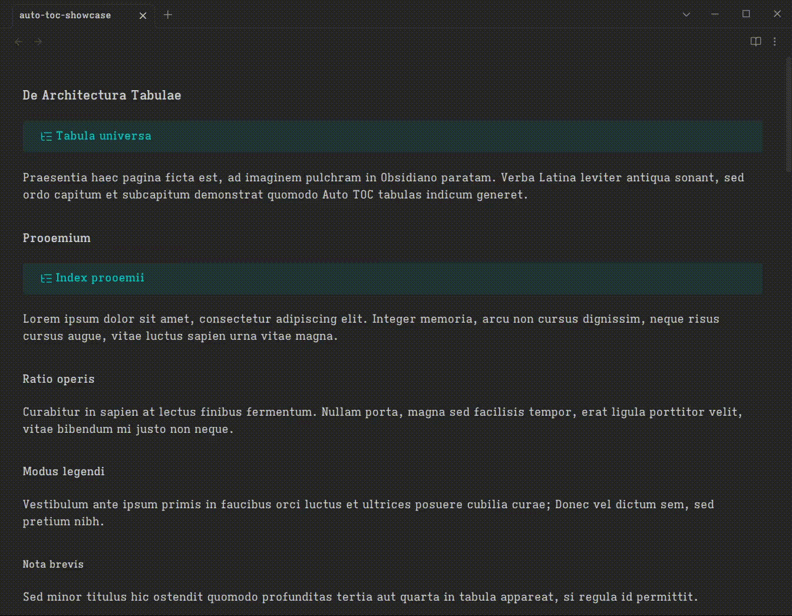

# Auto TOC

Auto TOC is an Obsidian plugin for generating real Markdown tables of contents inside notes.

The plugin writes the generated TOC directly into Markdown source inside `[!toc]` callouts.



## Usage

Add a TOC callout to a note, then run **Update table of contents in current note** from the command palette. The command rewrites only the TOC callout body. The first callout line is preserved exactly.

### Local TOC

`[!toc]` creates a local TOC for the nearest previous heading section.

Source:

```md
# Project

> [!toc] Contents

## Goals
## Scope
```

Generated:

```md
# Project

> [!toc] Contents
> - [[#Goals|Goals]]
> - [[#Scope|Scope]]

## Goals
## Scope
```

### Master TOC

`[!toc#master]` creates a TOC for the whole note.

Source:

```md
# Project

> [!toc#master] Contents

## Goals
## Scope
```

Generated:

```md
# Project

> [!toc#master] Contents
> - [[#Project|Project]]
>   - [[#Goals|Goals]]
>   - [[#Scope|Scope]]

## Goals
## Scope
```

### Depth

Use `depth` to control how many heading levels appear.

Source:

```md
# Project

> [!toc?depth=1] Contents

## Goals
### Primary outcome
## Scope
```

Generated:

```md
# Project

> [!toc?depth=1] Contents
> - [[#Goals|Goals]]
> - [[#Scope|Scope]]

## Goals
### Primary outcome
## Scope
```

### Bullet

Use `bullet` to choose the list marker.

Source:

```md
# Project

> [!toc?bullet=*] Contents

## Goals
## Scope
```

Generated:

```md
# Project

> [!toc?bullet=*] Contents
> * [[#Goals|Goals]]
> * [[#Scope|Scope]]

## Goals
## Scope
```

## Options

Callout query options:

- `depth`: `1` through `6`
- `bullet`: `-`, `*`, or `+`

See [examples/auto-toc-showcase.md](examples/auto-toc-showcase.md) for a larger source note that showcases master TOCs, local TOCs, frontmatter defaults, depth, and bullet options. See [examples/auto-toc-showcase-rendered.md](examples/auto-toc-showcase-rendered.md) for the generated result.

## Settings

Open **Settings → Community plugins → Auto TOC** to configure defaults.

- **Depth**: maximum heading depth to include (1–6, default 3)
- **Bullet**: list bullet character (`-`, `*`, or `+`, default `-`)
- **Auto-update**: automatically update TOCs when editing (default off)
- **Update delay**: seconds to wait after editing before updating (default 10)

### Folder and file overrides

Override defaults for specific folders or files in **Settings → Community plugins → Auto TOC**.

- Folder overrides match by longest vault-relative prefix: `journal/` matches `journal/2024/note.md`.
- File overrides match by exact vault-relative path.
- File overrides take priority over folder overrides.
- Each override can set depth, bullet, or both.
- Folder and file override sections can be disabled independently without deleting saved overrides.

Example: set depth 2 for everything in `projects/` but depth 5 for `projects/important.md`.

### Frontmatter overrides

Use frontmatter when a note should carry its own TOC rendering defaults:

```yaml
---
auto-toc.depth: 2
auto-toc.bullet: "*"
---
```

Frontmatter overrides beat vault defaults, folder overrides, and file overrides. Callout query options still have the highest precedence for a single TOC callout.

Callout query options override vault defaults per callout:

```md
> [!toc?depth=2]
> [!toc?depth=2&bullet=*]
> [!toc#master?depth=3&bullet=+]
```

### Automatic updates

Enable **Auto-update** to refresh TOC callouts after editing Markdown notes. Auto TOC waits for the configured update delay after the last file modification, updates only changed TOCs, and ignores writes made by the plugin itself.

Auto-update is disabled by default.

## Development

Install dependencies:

```bash
npm install
```

Run tests:

```bash
npm run test
```

Build the plugin:

```bash
npm run build
```

Start the development build watcher:

```bash
npm run dev
```

## Manual installation for testing

Build and install the plugin into a vault:

```bash
npm run install-plugin -- --vault /path/to/YourVault
```

You can also set the vault path with an environment variable:

```bash
OBSIDIAN_VAULT=/path/to/YourVault npm run install-plugin
```

The install command builds the plugin, then copies these files into `.obsidian/plugins/auto-toc/`:

- `main.js`
- `manifest.json`
- `styles.css`

Reload Obsidian and enable **Auto TOC** in **Settings → Community plugins**.

## Release

Create a GitHub release with a tag that exactly matches `manifest.json` version, without a leading `v`.

```bash
git tag 1.0.0
git push origin 1.0.0
```

The release workflow builds the plugin and uploads:

- `main.js`
- `manifest.json`
- `styles.css`

## Privacy

Auto TOC is designed to work locally inside your vault. It does not use telemetry or network services.
